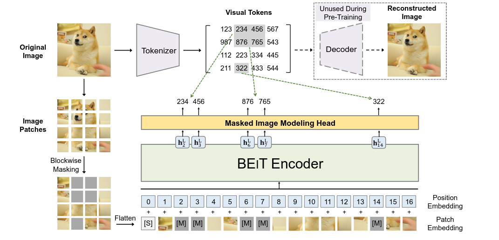
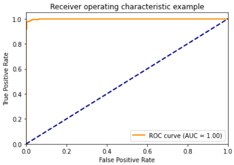

# Self Supervised Learning

## THEORY

- Transformers has achieved remarkable performance in NLP and Computer Vision related tasks.
- However transformer require more training data than CNN. So self supervised learning is a promising solution to solve the data hungry issue.

### Self Supervised Learning (SSL)

- It is a type of machine learning technique where a model is trained using unsupervised learning methods to solve supervised learning tasks.
- In SSL, the model is trained on a pretext task that requires it to learn from the input data without the need for any labeled output data. The learned features from the pretext task can then be transferred to solve a downstream supervised learning task.
- An example of SSL is the use of <b>contrastive learning</b> to train a model to differentiate between similar and dissimilar image patches. In this case, the model is trained to predict whether two patches of an image are similar or dissimilar, without the need for any labeled data. The learned features can then be used for downstream tasks such as image classification or object detection.
- The main difference between <b>unsupervised</b> and <b>self-supervised</b> learning is that in unsupervised learning, the model is trained to learn the <b>underlying structure of the data</b>, while in self-supervised learning, the model is trained to <b>learn a specific task</b> that can be transferred to solve a downstream supervised learning task.

### Equivariant Transformer

- An equivariant transformer is a type of neural network architecture that is designed to learn equivariant representations of data. "Equivariant" means that the network's behavior is consistent with a certain group of transformations applied to the input data.
- In the case of an equivariant transformer, the input data is typically a set of objects with some kind of spatial or relational structure, such as a set of 3D point clouds or a graph. The network is designed to learn a set of features that are invariant to the group of transformations applied to the input data. For example, if the input data is a set of 3D points, the network might learn features that are invariant to rotations or translations of the points.
- Equivariant transformers have been shown to be effective for a variety of tasks, including 3D point cloud segmentation and graph classification. They are particularly useful for tasks where the input data has a spatial or relational structure and where equivariance is an important property of the data.

### BEiT (Bidirectional Encoder representation from Image Transformer)

1. BEiT introduces a pre training task called as <b>Masked Image Modeling (MIM)</b>.
2. MIM uses two views for each image, <b>image patches</b> and <b>visual tokens</b>.
3. The image is split into a grid of patches that are the input representation of a backbone transformer.
4. During pre-training, each image has two views, i.e., image patches, and visual tokens. Some proportion of image patches are randomly masked (gray patches in the figure) and replaced with a special mask embedding [M].
5. Then the patches are fed to a backbone vision
   Transformer. The pre-training task aims at predicting the visual tokens of the original image based
   on the encoding vectors of the corrupted image.
6. The authors of the paper perform self-supervised learning and then fine-tune the pretrained BEIT on two downstream tasks, i.e., image classification, and semantic segmentation. Experimental results indicate that BEIT outperforms both from-scratch training and previous strong self-supervised model.

### EsViT (Efficient Self-Supervised Vision Transformer)

- EsViT exploits Knowledge Distillation with a fixed teacher network and a student network that is continuously updated in an attempt to minimise a loss function.
- An interesting peculiarity, in that case, is that it employs a multi-stage transformer instead of a monolithic one and exploits sparse attention to reduce computation. The loss function of the overall model is given by the combination of two distinct losses, a Region Loss and a View Loss.
- It combines both equivariance and self supervision properties.

## APPROACH

1. <b>Data Preprocessing</b>: Load and preprocess the dataset using `dataloader` from `transformer` library and `transfroms` from `PyTorch`. The dataset is split into training and validation datasets (90:10 split).

2. A pretrained model `microsoft/beit-base-patch16-224` is used to train on the given dataset.

3. `BeitforImageClassification` is used to perform the downstream task of Image classification.

EsViT has equivariance property and also self supervision. But due to resource (GPU) constraint, I couldn't try it on the given dataset. I will try to use this model as soon as I get access to a GPU.

## Results

After training for 10 epochs on Google Colab, the model achieved an accuracy of 98%

<h1>ROC Curve</h1>

## References

1. [BEiT](https://arxiv.org/pdf/2106.08254.pdf)
2. [EsViT](https://github.com/microsoft/esvit/)
3. [Self-Supervised Learning in Vision Transformers](https://towardsdatascience.com/self-supervised-learning-in-vision-transformers-30ff9be928c)
